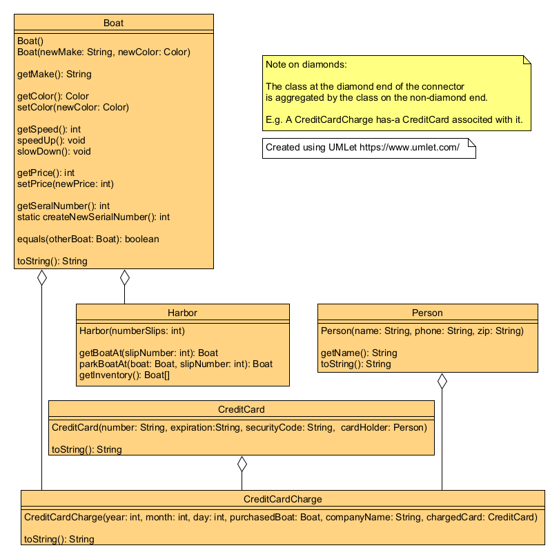

# JavaClasses
 _(derived from CISC191M3BeginningClasses)_


Java Test Driven Development (TDD) project to review simple Java classes with unit testing ( with **JUnit** )

________

## Learning Outcome
- _preliminary_
________


# San Diego Mesa College CISC 191 Programming Challenges
Programming challenges for San Diego Community College CISC 191 Intermediate Java classes.

Created by
- Professor Dr. Tasha Frankie
- and Professor [Allan Schougaard](https://github.com/schougaard), San Diego Mesa College.

With contributions from: 
- Dom David,
- [Dan Sullivan](https://github.com/uid100)

________

## Learning Outcome
- _preliminary_
-------

## Assignment Overview
_Java_ classes are the building blocks of Java programs. They are used to define the data and behavior of objects. Classes are needed in Java because they provide a way to encapsulate data and behavior, which makes programs more modular, reusable, and maintainable.

Here are some of the specific reasons why Java classes are needed:

- To define the data and behavior of objects: A class defines the data that an object can hold, as well as the methods that an object can perform. This allows us to create objects that have specific properties and can perform specific actions.
- To improve modularity: Classes can be grouped into packages, which makes it easier to organize and manage code. This also makes it easier to reuse code, as we can simply import the classes that we need from a package.
- To improve reusability: Classes can be reused in multiple programs. This saves time and effort, as we don't have to rewrite the same code over and over again.
- To improve maintainability: Classes make it easier to maintain programs, as changes to a class can be made without affecting other parts of the program.

In short, Java classes are essential for writing well-organized, reusable, and maintainable Java programs.

________

## Instructions

## _(Open the Project)_
1. From the **<> Code** dropdown link in the repository (above), download the Zip file to your computer.
2. Extract the files to your working folder
3. Open Eclipse and import the project. 
   - You can use File>Import menu item or right-click in the Package Manager and choose Import.
   - select General>Projects from Folder or Archive
   - navigate into the project until you see the `bin` and `src` folders, and choose *open*
4. Expand the project in the package explorer and find the .java files below the **src** folder.

## _(Complete the Assignment)_

In this challenge you are going to write code to support a boat shop.

The shop needs to be able to store data about their boats, such a make, color, speed and price. Furthermore, the shop also needs to keep track of where their boats are stored.

### Boat
#### Part 1
##### First Tester Method
Let's try to get the first tester method to compile. The first thing you will notice is the missing getPrice method from the Boat class. When you use a method that does not exist you will get the message: The method <<method name>> is undefined for the type <<Class>>. Add this method to the Boat class.

```
public int getPrice() {
  // TODO Auto-generated method stub
  return -1;
}
```
Now the default return is currently -1, but if you look at the existing methods in the Boat class they are actually getters. Getters for a class help with retrieval of instance variables of that class so they usually pair with an instance variable. Let's add all the missing instance variables at the very top of the class and make sure to keep them private to follow a common java programming paradigm called encapsulation where you limit the access to instance variables of a class.

```
private String make; // a Boat has-a make
private Color color; // you should add the remaining comments for the instance variables
private int speed;
private int price;
```
Go back to the methods in Boat and correct them so that they are correct getter methods. You will notice that all of them will have a typical default value for their type with exception of the price which should return -1. You can fix this in a variety of ways, but add a default constructor that will set all the initial values of these variables rather than setting them directly at the top.

At this point, go ahead and also add the default constructor. The default constructor of a class is a no-parameter constructor. Remember that constructors help assign values to instance variables so you should have assignment statements as shown below.

```
public class Boat()//<-- no parameter constructor a.k.a. default constructor
{ 
  //the job of the constructor is to initialize the instance variable
  make = null;
  color = null;
  speed = ?; //what should be the initial speed?
  price = ?; //see the tester method for the default value for the price. Hint: It's not 0. 
}
```

#### Part 2
Tester Method 2 & 3
Before starting the 2nd tester method, be sure you have a default constructor for Boat. As discussed at the end of Part 1, a default constructor is a constructor with no parameters. The second tester method will try to use a non-existing constructor and will give the error: The constructor Boat(String, Color) is undefined. Add a second constructor in Boat with the corresponding parameters from the tester method. It should look like the constructor below. Although you are given a lot of code for Boat, this will not be the case for the other set of code.

```
public Boat(String initMake, Color initColor) 
{
  make = initMake;
  color = initColor;
}
```
Now, you still want to set the default values of the other instance variables for which there are no parameters. Rather than re-writing the initialization lines from the default constructor, you can invoke the default constructor within another constructor as shown below. This can be useful, especially in cases where a lot is going on in the default constructor. You can prevent too much code from being repeated.

```
public Boat(String initMake, Color initColor) 
{
 this(); //invoke default constructor
 make = initMake;
 color = initColor;
}
```
Uncomment the 3rd tester method. We will cover that in this section since it also deals with constructors. Add the missing constructor based on the tester method. This constructor will create a new Boat from an existing Boat by setting the instance variable values to be the same as the Boat object parameter. Some of you may wonder why you do not need the getter methods when accessing the values of the parameter Boat object. In Java, you can access the instance variables direction through the dot operator if the code is from the class in which the object was created. In this case, the boat object called otherBoat is being access in the Boat class! In other words, this is not possible outside of the Boat class. Feel free to try it and experiment in eclipse if you wonder or are slightly skeptical.

```
public Boat(Boat otherBoat) 
{
 make = otherBoat.make;
 color = otherBoat.color;
 speed = otherBoat.speed;
 price = otherBoat.price;
}
```
The last thing required to make the 3rd tester method compile is to include the setter for Price. You will see that the second line of code is invoking (calling) the setPrice method which may or may not exist yet. Below is the setter. You're given this code since it's part of your previous course content and was covered in some of the 190 review videos (most sections had a presentation).

```
public void setPrice(int newPrice)
{
   price = newPrice;
}
```

#### Part 3
Setters
Setters, also known as mutators, are specific methods of a class that set the values of the instance variables. Below is the common syntax for setters.

```
public void setINSTANCEVARNAME(InstanceVarType initValue)
{
    /* assignment statement */
}
```
For example, the Boat class has a color instance variable so it would be great if given a Boat object, you could set the color after instantiation. Below would be the setter for the color.

```
public void setColor(Color initValue)
{
    color = initValue;
}
```
How is this used in the JUnit test? Well, to use a setter, which is an instance variable, there must be an instance of the class. You must first create an object (instantiate) then you can use any instance method of that object using the dot operator on the name of the object. Below is an example pulled from the JUnit tester.

```
//1) Instantiate a Boat object (create one)
Boat boat = new Boat();

//2) Use the dot operator on the object name then call any public instance method
boat.setColor(Color.GREEN);
```
Go ahead and write the setters for color, and price or any other missing setter.
#### Part 4
##### speedUp && speedDown
Not every method in a Java class is specifically a mutator or accessor (getter or setter).

The speedUp and speedDown methods will increment or decrease the speed of a boat object. See if you can figure out the method header.

##### toString
Printing objects is a common thing to perform in programming. However, until the printing of the object has been defined, the output will not be too useful. Want to see what happens? Run the testToString JUnit test before any implementation and you will see that it will not know how to print your custom object. What you get is something similar to Boat@3646a422. The numbers you see in this output is the hashcode of the object based on its properties. We won't get into detail about the importance of this hashcode, but in the context of this programming assignment, it is not a very informative piece of information.

What we want is a String representation of the object. Specifically, we would like to get back the make, and the color of the Boat object anytime we wish to print it to the console or call the toString method.

The toString method must be overridden since it is a method that belongs to the Object class which every class extends (more on this later in the next module). Your takeaway in this module is that you must provide your version of toString if you wish your object to do more than just print the hashCode when being printed to the console or when toString is invoked on your object.

Overriding the toString method means you MUST use exactly the method header below.

public String toString()
{
   return "hello world" ; //replace this with your code
}
You must build the String that creates the desired String by the tester. Below are examples of building a String from the attributes of a Boat. It is not exactly what you need so you must edit it.

public String toString()
{
  return "My Boat costs "+price +" and the color is " + color;
}
Note that some of the classes we use in this class are Java classes and thus likely have the toString method overridden. Anytime you concatenate an object to a String you're implicitly calling the toString method of that object. In the code above, the color object's toString method will be implicitly (automatically) called.


##### Static Methods!
###### createNewSerialNumber
When you have a helper method that is a useful behavior of the class itself, you can declare it as a static method. In this programming assignment, you will be creating the createNewSerialNumber static method. The header is mostly the same but the static keyword must now be included. Static methods only have access to other static variables and methods. Therefore, we must pair this method with a static variable that will define the "unique" serial numbers of boat objects made from the Boat class.

Add a static int variable where you added the instance variable. Remember to include the static keyword for this variable. Initialize the value to 1. The method must return the next available serial number and increment the static variable so that the next call to the method will return that value. 

###### getSerialNumber
Now that you have a way to generate serial numbers, albeit not the most unique SNs, you should now use this functionality when creating Boat objects. Every boat object created should be given a unique serial number. For example, if you create 3 Boat objects, then each of those Boat objects will have their unique serial number which should never change.

Hint: Set the serial number during creation. What part of a Java class deals with the "creation" of the object? (The constructor(s) !)

### Harbor
Before you continue, go ahead and visit the style guide from the module. Comment on your Boat class per the required style.
The Harbor class will be a class that has many Boat objects. This means you should be using a data structure (Arrays!).
#### Constructor
A Harbor is created with a parameter that corresponds to the number of spots for Boats. Hint: The size of your array.

#### getBoatAt
This method should return the boat at the given index, null if that spot is empty.

#### parkBoatAt
This method will set the position in the array, but if there is a Boat at the given position, return that object. Otherwise, it returns null.

#### getInventory
Return a copy of the inventory. Hint: This is not just a getter/accessor for the one-dimensional array of Boat objects! Make sure to write your code to create the copy; do not use the Arrays class or a clone method.

For the remainder of the classes, see if you can figure out the logic based on the tester.
Hints: You will have to override the toString method multiple times in this programming assignment. Make sure you include the required white spaces!
 
___________
## Complete and zip the project
1. Run  and add the code to the source file
(`M2ArrayChallenge.java`) until the tests are successful.
2. Uncomment each test case in the **Test** file (`TestBeginningClasses.java`), one at a time. 
Do not modify the content in this file except to uncomment the tests. Add and modify class files
as needed for the tests to pass.
3. Review and refactor any of the code as needed:
    - be sure your code follows good coding practices and coding style and standards.
    - update the javadoc comments at the top of the file to add your name as author
    - update the comments for each method in the file.
4. Export the project as a zip file and submit your work.

___________

## Rubric

[Rubric](Rubric.md)


___________

_this repository is a subset of the CISC191 exercises. It is derived from the CISC191ProgrammingChallenges 
activity hosted by Professor Allan Schougaard, San Diego Mesa College, and not a direct fork._

_This project is to decompose that repository into git submodules_
